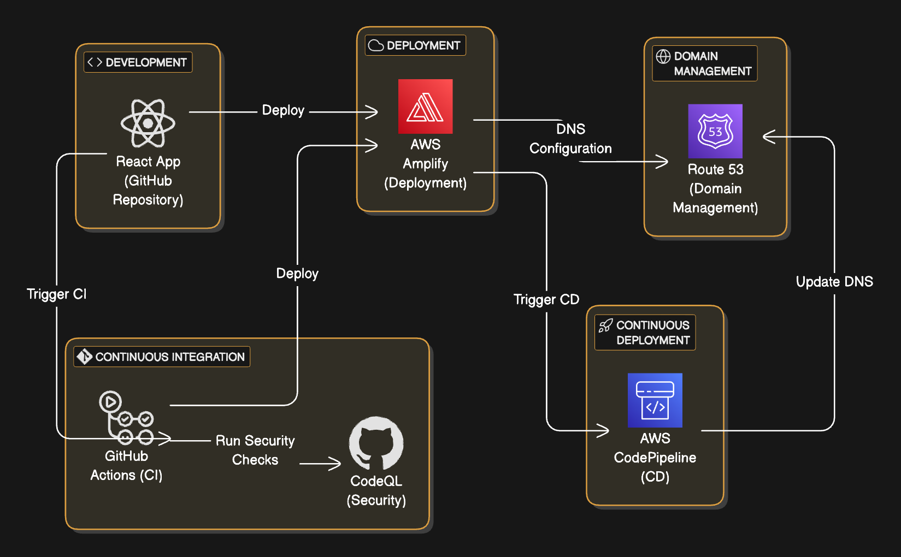

# React App Personal Website

## Overview
This project is a **React-based personal website** that serves as an online portfolio to showcase my projects, skills, and experience. The website is fully responsive, ensuring a seamless user experience on both desktop and mobile devices. It was built with modern front-end technologies and deployed using robust AWS services for scalability and performance.

---

## Features
- **Responsive Design**: Adapts seamlessly to various screen sizes, including desktop, tablet, and mobile.
- **Custom Deployment Pipeline**:
  - **Continuous Integration (CI)**: GitHub Actions for automated code quality checks.
  - **Continuous Deployment (CD)**: AWS Amplify for automated builds and deployments.
- **Domain Management**: Custom domain managed with AWS Route 53.
- **Architecture Diagram**: Visual representation of the project's deployment workflow.
- **Portfolio Projects**: Showcases other key projects with links to their live versions and GitHub repositories.

---

## Technologies Used
### Frontend
- **React.js**: Framework for building the user interface.
- **CSS**: For responsive styling.
- **JavaScript**: For functionality and interactivity.

### DevOps & Deployment
- **AWS Amplify**: Handles deployment and hosting.
- **AWS Route 53**: Custom domain name management.
- **GitHub Actions**: CI pipeline to ensure code quality.
- **CodeQL**: Security checks and static code analysis.

---

## Architecture Diagram
Below is the architecture diagram for the deployment workflow:



### Workflow:
1. Code changes pushed to the GitHub repository trigger **GitHub Actions**.
2. Security checks run using **CodeQL**.
3. Successful builds are automatically deployed to **AWS Amplify**.
4. DNS updates are managed through **AWS Route 53** for the custom domain.

---

## How to Access
### Live Website
Visit the live version of this website: [React App Personal Website](https://lopezbio.com)

---

## How to Run Locally
Follow these steps to run the project locally:

1. **Clone the Repository**:
   ```bash
   git clone https://github.com/donlopez/personal-web-app.git
   cd personal-web-app 
